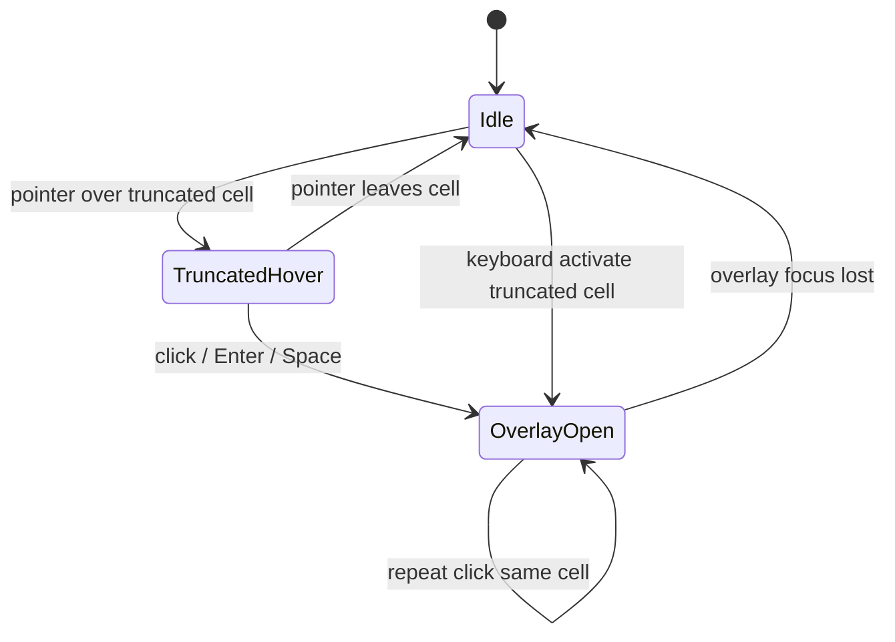
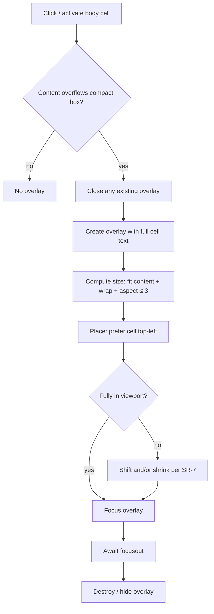
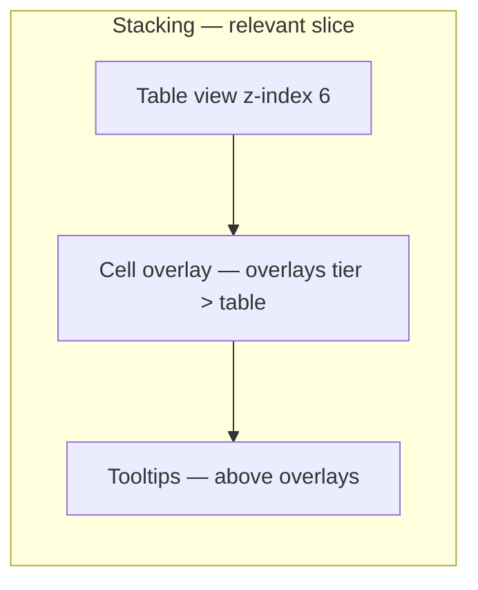

> [documentation](/documentation) / [developers](/documentation/developers) / [ui](/documentation/developers/ui) / [table-view-compact-cells](/documentation/developers/ui/table-view-compact-cells)

# Table view · compact columns and cell overlay

Technical specification for the Data page table view (`.content-table`): compact column widths and a cell content overlay that does not shift neighbouring cells.

Related:

- [components](components) — Table view
- [technical-standards](technical-standards) — layering, focus, layout stability
- [visual-style](visual-style) — density, elevation

Current implementation anchors (for implementers; this document prescribes behaviour, not the existing code):

- `app/frontend/assets/js/data/content-view/table-view.js`
- `app/frontend/assets/js/data/content-view/table-cell-overlay.js`
- `app/frontend/assets/css/index.css` (`.content-table*`, `.file-content.content-table-view`)
- Patterns: `app/frontend/assets/js/shared/tooltip.js` (viewport clamp, dismiss), sidebar hover-expand (expand without shifting neighbours)

---

## Goal

Make the table denser: column width follows the header (with a floor), long cell text is truncated in place, and the full cell value is readable on demand via an overlay that does not change table layout.

---

## Scope

In scope:

- Data columns of `.content-table` (header cells with a column key label and body cells with formatted values)
- Column width rule, cell truncation, cell overlay open/close, overlay size and position

Out of scope:

- Change of sort, Magic fill, bool-sum rail, export, or view-switch behaviour
- Replacing the shared app tooltip (`#app-tooltip`)
- Service / non-data columns that do not show a data value (for example the Magic fill column when present): they keep their current sizing and do not open a cell overlay

---

## Terms

| Term | Meaning |
| --- | --- |
| Data column | A column whose header shows a field key and whose body cells show that field’s value |
| Compact width | Width of a data column derived from its header, not from the widest body cell |
| Truncated cell | A body cell whose content does not fully fit in the compact cell box |
| Cell overlay | A floating surface that shows the full cell value above the table without changing cell or column geometry |
| Aspect ratio bound | For overlay box size `(W, H)`, `max(W, H) / min(W, H) ≤ 3` |

---

## Current behaviour (baseline)

- Table uses `width: max-content` and cells use `white-space: nowrap`
- Each column grows to the widest cell in that column
- There is no truncation and no cell overlay
- `.file-content.content-table-view` uses `z-index: 6` (raised local content)

---

## System requirements

### SR-1 · Compact column width

1. For each **data column**, the column width equals the width needed to display the **header cell content** of that column (label, sort indicator, and any in-header controls that belong to that header), without wrapping the header
2. The column width must be **at least 3 cm** (`min-width: 3cm` or equivalent measured min)
3. Body cells of that column must not widen the column beyond the compact width
4. The table may still grow horizontally across columns; horizontal scroll of `.content-table__wrapper` remains available when the sum of column widths exceeds the wrapper

### SR-2 · Truncation in the grid

1. If a body cell’s content is wider than the compact cell content box, the visible text in the grid is truncated (single line, no wrap in the grid cell)
2. Truncation must not change the height or width of neighbouring cells or columns
3. A truncated cell must remain distinguishable as truncated (for example ellipsis)

### SR-3 · Overlay activation

1. Opening the overlay requires a **click** (pointer primary activation) on a **truncated** body cell after the pointer is over that cell (hover then click)
2. Click on a non-truncated body cell must not open an overlay
3. At most one cell overlay is open at a time
4. Keyboard users must be able to open the same overlay for a truncated cell without relying on hover alone (focus the cell, then activate — Enter or Space), consistent with [technical-standards](technical-standards)
5. A repeat click on the **same** truncated cell while its overlay is already open must **not** close the overlay (the user may need to select text inside the overlay)

### SR-4 · Overlay does not affect table layout

1. Opening, resizing, or closing the overlay must not change the position or size of any table cell, column, or row
2. The overlay is drawn as a separate layer above the table (overlay stacking level), not by expanding the cell in-flow
3. Overlay `z-index` must be **strictly greater** than the table view stacking context (currently `.file-content.content-table-view` at `6`), and must use the shared **overlays** level from the ordered z-index scale in [technical-standards](technical-standards) — not the tooltip tier

### SR-5 · Overlay content

1. The overlay shows the **same full string** that the cell represents (the untruncated cell value text)
2. Content wraps inside the overlay according to the overlay’s content width
3. All of that content must be fully readable in the overlay (no truncation of the value inside the overlay under normal viewport conditions — see SR-7 for the constrained-viewport case)

### SR-6 · Overlay size and aspect ratio

1. Overlay width and height may grow as needed to fit the content
2. At all times after sizing: `max(W, H) / min(W, H) ≤ 3`
3. If fitting the content at a candidate width would violate the aspect ratio bound, the other dimension (or the width used for wrapping) must be adjusted so that both the content fits and the bound holds
4. Minimum overlay size is not required to match the cell size; preferred visual anchor is position (SR-8), not matching dimensions
5. Overlay box must not exceed **50% of the viewport width** and **50% of the viewport height** (each dimension capped independently before position clamping)

### SR-7 · Overlay within viewport

1. The overlay must lie **entirely** inside the browser viewport (all four edges)
2. A small inset from the viewport edge is allowed (same idea as tooltip edge margin; a fixed small padding such as 6 px is acceptable)
3. If the preferred size from SR-5–SR-6 does not fit in the viewport, reduce the overlay box to the largest size that still:
   - fits in the viewport (with inset)
   - respects the aspect ratio bound
   - and keeps content accessible (if the reduced box cannot show all content without scrolling, the overlay content area may scroll — this is the only case where overlay content may not be fully visible without scrolling)

### SR-8 · Overlay position

1. Preferred alignment: the **top-left** corner of the overlay coincides with the **top-left** corner of the triggering cell (viewport coordinates)
2. If that placement would clip the overlay against the viewport, shift the overlay by the minimum needed so it stays fully inside the viewport (SR-7)
3. Shifting may move the overlay relative to the cell corner; alignment with the cell is preferred, not mandatory when it conflicts with SR-7

### SR-9 · Overlay dismissal (focus loss)

1. The overlay must be able to receive focus when opened
2. When the overlay **loses focus** (focus moves outside the overlay), the overlay is removed / hidden
3. Closing the overlay restores the prior interaction context without leaving a stuck elevated layer
4. **Escape must not** close the overlay; only focus loss dismisses it
5. No dedicated scroll-dismiss logic: the overlay is positioned relative to the cell at open time; if scrolling causes focus to leave the overlay, it closes naturally via SR-9.2

### SR-10 · Visual and a11y constraints

1. Overlay elevation may use a light shadow / border consistent with [visual-style](visual-style) (elevation for floating surfaces)
2. Overlay text uses the same readability expectations as table body cells (monospace family already used for `.content-table__cell` is appropriate)
3. Focus-visible on the overlay (and on activatable truncated cells) must meet [technical-standards](technical-standards)
4. Contrast of overlay text against its background ≥ 4.5:1

---

## Behaviour model

---

## Column width — technical rules

### Measurement basis

- Compact width is driven by the **header cell** of the data column, not by body cells
- Header remains single-line (`nowrap`)
- Effective column width: `max(header intrinsic width, 3cm)`
- Body cells: fixed to that column width; content clipped per SR-2

### DOM / CSS expectations (prescriptive)

- Stop sizing the table from the widest body cell for data columns (remove the effect of body `max-content` driving column width)
- Body cells: single-line truncation (`overflow: hidden`, ellipsis, no wrap in the grid)
- Header cells: still define the natural width of the column (plus the 3 cm floor)
- Service columns (Magic fill): unchanged; not subject to the 3 cm floor unless they already need it for their controls

### Interaction with sticky header

- Sticky header (`position: sticky; top: 0` on header cells) remains
- Truncation and overlay must not break sticky header painting within the scroll wrapper

---

## Cell overlay — technical rules

### DOM placement

- Overlay node is not an in-flow expansion of the `<td>`
- Prefer mounting on `document.body` (or another non-clipping root) so `.content-table__wrapper { overflow-x: auto }` and table stacking do not clip it — same rationale as `#app-tooltip`
- One active overlay element at a time

### Identity and classes

- Reusable class(es) for the overlay surface and its content (no page-unique `id` required unless a single global overlay host is chosen; if a single host is used, one `id` is allowed per [technical-standards](technical-standards))
- Do not style the overlay via page-only DOM ancestry when a component class can express it

### Content

- Plain text equal to the cell’s full display string (same formatting as `formatCellValue` / current `td.textContent`)
- Wrapping enabled inside the overlay (`white-space` normal / pre-wrap as needed so JSON-like long strings still wrap by available width; unbroken tokens may force width growth under SR-6)

### Focus

- On open: move focus into the overlay (or make the overlay focusable and focused)
- On `focusout`: if the new focus target is outside the overlay, dismiss (SR-9)
- Pointer click that opens the overlay must result in a focused overlay so that subsequent focus loss is well-defined

### Hit-testing vs neighbours

- Overlay may cover neighbouring cells visually
- Covered cells are not “expanded”; their layout boxes stay compact
- Clicks on the overlay stay on the overlay; clicks outside move focus away and dismiss per SR-9

### Positioning algorithm (normative outline)

1. Measure the triggering cell’s `getBoundingClientRect()`
2. Set overlay content to the full string
3. Compute `(W, H)` such that:
   - wrapped content fits in the content box
   - `max(W,H) / min(W,H) ≤ 3`
   - among valid sizes, prefer a compact box (no unnecessary empty space)
4. Set preferred `left = cell.left`, `top = cell.top` (CSS `position: fixed` in viewport coordinates is the intended model)
5. Clamp `left` / `top` so `left ≥ inset`, `top ≥ inset`, `left + W ≤ viewportWidth − inset`, `top + H ≤ viewportHeight − inset`
6. If `(W, H)` cannot fit even after clamping position, shrink per SR-7, re-wrap content, re-check aspect bound, then clamp again
7. Round pixel positions for stable painting

### Aspect ratio computation (normative intent)

Given content and a wrapping width `W`:

- Let `H` be the height needed to show all wrapped lines at that width (plus padding)
- If `H > 3W`, increase `W` (and remeasure `H`) until `H ≤ 3W` or viewport limits apply
- If `W > 3H`, increase `H` only if needed for padding/minimums, or reduce `W` and re-wrap so `W ≤ 3H`, without truncating content
- After viewport shrink: re-apply the same bound to the final used `(W, H)`

Exact numeric search method is an implementation detail; the acceptance criterion is the bound and full content accessibility.

### Layering

---

## Acceptance criteria

| ID | Criterion |
| --- | --- |
| AC-1 | With long body values and short headers, columns are no wider than `max(header width, 3cm)` for data columns |
| AC-2 | No data column is narrower than 3 cm |
| AC-3 | Body text longer than the cell is truncated in the grid with a visible truncation cue |
| AC-4 | Neighbouring cell positions do not move when a truncated cell is activated |
| AC-5 | Click on a truncated cell opens an overlay with the full value, wrapping inside the overlay |
| AC-6 | Click on a non-truncated cell does not open an overlay |
| AC-7 | Overlay top-left matches cell top-left when there is room; otherwise the overlay is fully inside the viewport |
| AC-8 | For the open overlay box, `max(W,H)/min(W,H) ≤ 3` |
| AC-9 | Moving focus out of the overlay closes it |
| AC-10 | Keyboard activation of a focused truncated cell opens the overlay |
| AC-11 | Overlay paints above the table and does not appear under sticky headers or clipped by the table wrapper |
| AC-12 | Sort, Magic fill, and bool-sum continue to work as before |

---

## Task decomposition

### T1 · Compact column CSS / layout

- **Refs:** SR-1, SR-2, AC-1–AC-3
- **Done when:** Data columns size from header + 3 cm floor; body cells truncate; widest body cell no longer drives width

### T2 · Truncation detection

- **Refs:** SR-3, AC-5–AC-6
- **Done when:** The UI can reliably tell whether a body cell overflows its content box (for gating overlay open)

### T3 · Cell overlay surface + focus lifecycle

- **Refs:** SR-4, SR-5, SR-9, SR-10, AC-4, AC-9–AC-11
- **Done when:** Overlay mounts out of flow, receives focus on open, dismisses on focus loss, does not shift the table

### T4 · Size (aspect ≤ 3) and viewport position

- **Refs:** SR-6, SR-7, SR-8, AC-7–AC-8
- **Done when:** Sizing and clamping match the normative algorithms; content readable; bound holds

### T5 · Keyboard path + regression pass

- **Refs:** SR-3.4, AC-10, AC-12
- **Done when:** Enter/Space (or equivalent) opens overlay for truncated cells; sort / Magic / bool-sum unaffected

### Suggested owners

- **Dev:** T1–T4 implementation in table view CSS/JS (optionally a small dedicated module next to `table-view.js`)
- **QA:** AC-1–AC-12, including viewport edges, very long JSON strings, short headers, and focus/keyboard
- **Design (optional check):** overlay elevation and truncation cue vs [visual-style](visual-style)

---

## Non-goals and explicit non-changes

- Do not use the shared tooltip component to show full cell values (different interaction: click + focus retention + large wrapping surface)
- Do not expand the `<td>` width/height in-flow to reveal content
- Do not require hover alone to open the overlay
- Do not change export cell formatting rules
